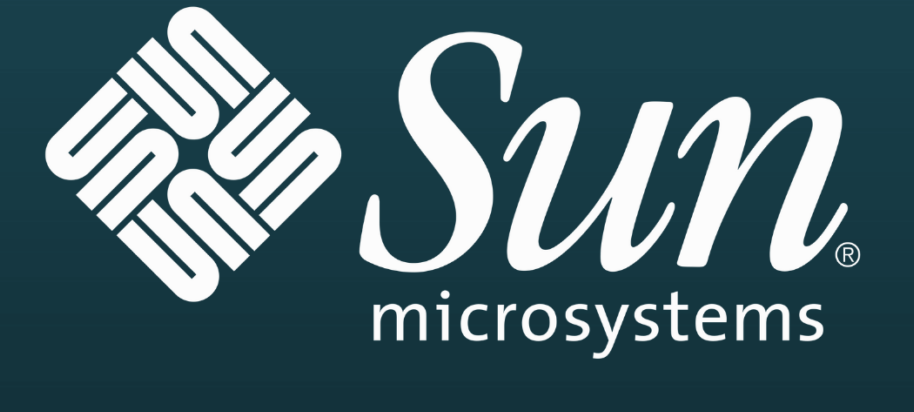

# SunToolList

This is a compilation of different software made by Sun Microsystems

-----------------------
### Operating Systems
- Solaris
- OpenSolaris
- JavaOs
-----------------------
### Programming Languages and Development Tools
- Java
- NetBeans
- Forte for Java
- JavaFX
-----------------------
### Web and Application Servers
- Sun Java System Web Server
- GlassFish
- Sun ONE Web Server
- JCAPS (Java Composite Application Platform Suite)
-----------------------
### Database Software
- MySQL
- Java DB
-----------------------
### Networking
- Sun Cluster
- NFS (Network File System)
- Sun QFS
-----------------------
### Virtualization
- VirtualBox
- Sun xVM Ops Center
-----------------------
### Office Software
- StarOffice
- OpenOffice.org
-----------------------
### Systems Management
- Solaris Volume Manager
- Sun N1
- Sun Management Center
-----------------------
### Middleware and APIs
Java EE (Enterprise Edition)
Java ME (Micro Edition)
-----------------------
### Identity Management
- Sun Java System Identity Manager
- Sun OpenSSO
-----------------------
### Hardware Management and Diagnostics
- SunVTS
- ALOM (Advanced Lights Out Manager)
-----------------------
### Libraries and Frameworks
- Swing
- Java 3D
-----------------------
### Messaging
- Sun Java System Messaging Server
-----------------------
### Other
- Lustre
- Sun Grid Engine
- Sun Java Desktop System
-----------------------

### Contributing

 Feal free to contribute.
 
-----------------------
### License 

The Unlicense

